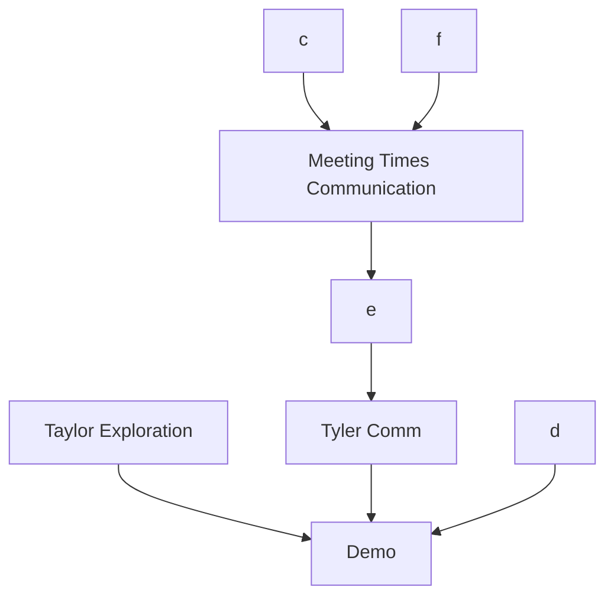

# todo

* c[Data Center node]
* f[Fix 'next_meeting' setting]
* e(Fix Relay state flow)
* d[Add Error State calls]

```mermaid
graph TD;
g[Meeting Times Communication]
a[Tyler Comm]
b[Taylor Exploration]

    c-->g
    e-->a
    g-->e
    b-->Demo;
    a-->Demo;
    d-->Demo
    f-->g
```